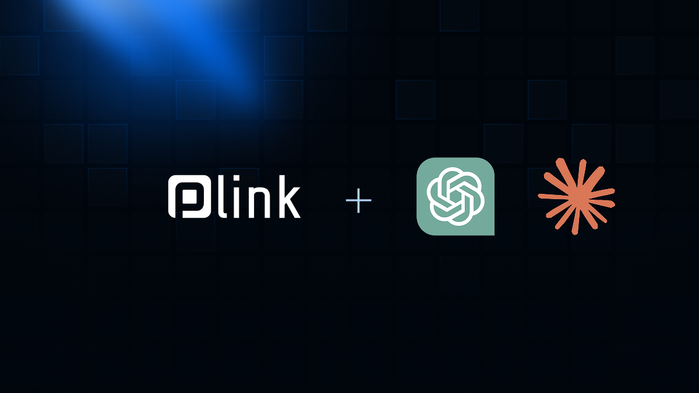

# 🧾 P-Link.io MCP Server

[](LICENSE)
[](https://youtu.be/MTsc_nKiofw)
[](https://github.com/paracetamol951/P-Link-MCP/stargazers)

[](https://youtu.be/sw9ASYZHEzY)

**P-Link MCP Server** is a server compliant with the **MCP (Model Context Protocol)**, allowing ChatGPT, Claude, and other MCP-compatible clients to connect to a **payment system** on Solana.

It provides a simple interface to:
- Pay 402 links  
- Create 402 payment links (still supporting human payment by card, or wallet) 
- Send money to any email or phone number  
- View transaction history
- View wallet information (balance, public wallet address)


> 🟢 Live Server: [https://mcp.p-link.io](https://mcp.p-link.io)

---

**Connect your Solana wallet to ChatGPT, Claude, or n8n — and manage your purchases simply by talking.**

This project exposes the **p-link.io** API as **Model Context Protocol (MCP)** tools, available over **HTTP (Streamable)** and/or **STDIO**.

---

## 🚀 Features

- **send_money**: Send an amount of money to a wallet, an email, or a phone number. Can be any email or phone number. If the user has no P-Link account, an account is created for him and the access is emailed or sent by phone. If the user already has a P-Link account, the wallet is reused. **If the account is not claimed within 3 days, the funds are returned to the sender.**
- **request_payment_link** : Create a payment link in order to be paid the desired amount, you can also provide a webhook that will be called on payment success, or a notification email address, or customize the payment page using the parameters. The payment link obtained complies to the HTTP 402 specification.
- **get_my_wallet_info** : Get information about your wallet (balance, public address, etc)
- **get_wallet_history** : Retrieve list of the transactions related to my Solana wallet
- **pay_and_get_402_protected_url** : Pay a HTTP 402 protected URL using your P-Link managed account, and returns the protected result

---

## 🔹 Example usage (ChatGPT / Claude MCP)

- 💬 “Hi ! What is the balance of my wallet ?”  
- 💬 “Can you buy the shoes i like at : https://p-link.io/@phh/0.01?PRODUCT=My_Favorite_shoes&id=888”  
- 💬 “Send 0.2$ to @Paracetamol”  
- 💬 “Send 0.2$ to s.smith@mail.com”  
- 💬 “Can you check the status of this transaction ?”  
- 💬 “Create a payment link of 10 euros”  
- 💬 “Show me my transaction history”  
- 💬 “Pay for this P-Link my friend sent me : https://p-link.io/@Paracetamol/0.1”  

---

## ⚙Prerequisities

You need to have a p-link.io account for some features.

If you don't have one, you can register at :

https://p-link.io

Then in the software, you have to get your APIKEY in API, Send money page.

---

## ⚙️ Installation

### Claude

#### Minimum installation

Edit the file `claude_desktop_config.json` in your Claude Desktop configuration directory:

Windows
```
%APPDATA%\Claude\claude_desktop_config.json
```

Mac OS
```
~/Library/Application Support/Claude/claude_desktop_config.json
```

Provide the following content after replacing your SHOPID and APIKEY.

```json
  {
  "mcpServers": {
    "plink": {
      "command": "npx",
      "args": [
        "plink-mcp-server",
        "--apikey=[replaceWithYourAPIKEY]"
      ]
    }
  }
}
```

#### Install via npx

Create an installation folder and run the following command in your shell:

```bash
npx plink-mcp-server --apikey=abcdef123456
```

#### Install via npm

```bash
# 1) Dependencies
npm install

# 2) Environment variables (see below)

# 3) Build
npm run build
```

#### Configuration

The binary/runner launches `src/stdio.ts` and communicates via MCP stdin/stdout.  
Npm install configuration file `claude_desktop_config.json`

```json
{
  "mcpServers": {
    "plink": {
      "command": "node",
      "args": [
        "{{PATH_TO_SRC}}/build/stdio.js"
      ],
      "cwd": "{{PATH_TO_SRC}}",
      "env": {
        "APIKEY": "XXXXXXXX"
      }
    }
  }
}
```

### ChatGPT

> Requires a workspace account

In **Settings → Connectors → Create Connector**, fill in the following:

| Variable | Value |
|-----------|--------|
| `Name` | `P-Link` |
| `Description` | `Can process payments, send money, request payment` |
| `MCP Server URL` | `https://mcp.p-link.io/mcp` |
| `Authentication` | `oAuth` |

Once added, the connector will be **available in new conversations**.

---

### Environment variables

| Variable | Default | Description |
|-----------|----------|-------------|
| `APIKEY` | `----` | Required: your API key |

Create a `.env` file:

```env
APIKEY=XXXXXXXXXXXXXX
```

---

## ▶️ Launch

### HTTP Mode (Streamable MCP)

The HTTP mode requires a Redis server.  
It is recommended to use the hosted MCP HTTP/WebSocket server available at [https://mcp.p-link.io](https://mcp.p-link.io):

- **POST** `https://mcp.p-link.io/mcp` with a JSON-RPC MCP message  
- **GET** `https://mcp.p-link.io/health` → `{ "status": "ok" }`  
- **GET** `https://mcp.p-link.io/.well-known/mcp/manifest.json` → MCP manifest  

---

## 💻 Compatible Clients

- **ChatGPT (OpenAI)** — via external MCP configuration  
- **Claude (Anthropic)** — via “Tools manifest URL”  
- **n8n / Flowise / LangChain** — import via public URL 
- You are welcome to complete !

---

## 🧩 MCP Manifest Endpoint

The MCP API exposes a JSON manifest describing all available tools for compatible clients (ChatGPT, Claude, n8n, etc.).

### Public manifest URL

https://mcp.p-link.io/.well-known/mcp/manifest.json

> 🗂️ This URL is the one to provide to your MCP client when configuring the server.

---

## 📋 License

© 2025. GNU GENERAL PUBLIC LICENSE
